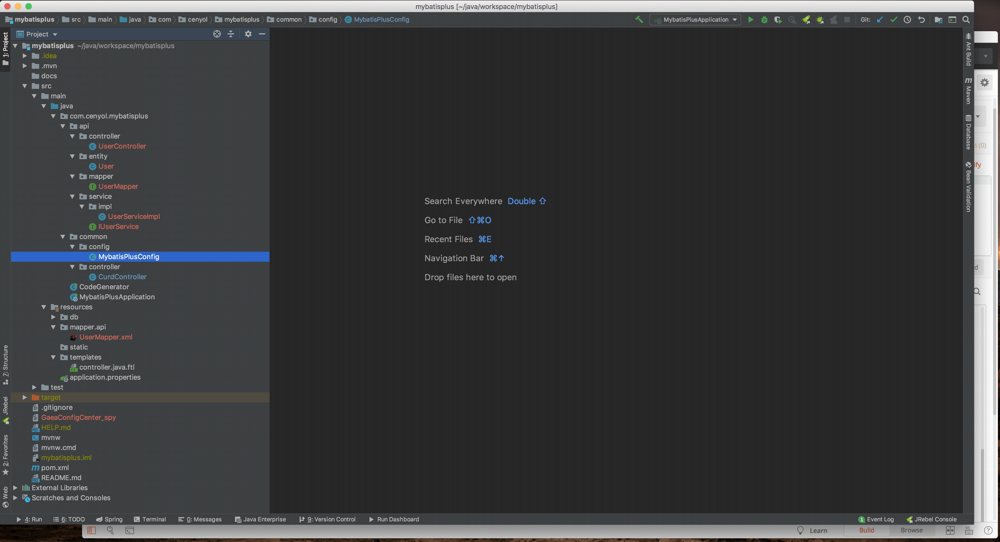

## 欢迎Clone

本项目基于 MyBatis Plus 进行定制，利用其提供的代码生成器快速生成模板代码。基本上从开始生成到启动运行访问/user/list, /user/get/1等接口的时候，不到五分钟。

而你所需要做的就是三步：
1. 设计数据库，并配置好数据库连接信息；
2. 运行代码生成器，一键生成多个库表对应的 controller,entity,mapper,service/impl 等文件；
3. 运行 springboot，打开 postman 测试接口运行效果。

建议深入了解并使用 [Mybatis Plus](https://mybatis.plus)，实乃开发利器！

##### 目前已有功能：
1. 一键快速生成 curd 模板代码，以此快速开发原生应用；

##### 计划功能
1. 使用 Ant.Design 后台模板接入，前后分离作为前端启动；

### Code Generator 用法

运行 com.cenyol.mybatisplus.CodeGenerator，然后输入表名即可。
会自动生成相应的 Controller、Entity、Mapper、Service 及其 Impl 等常用模板代码。

同时，由于已经封装好 CurdController，在生成的时候配置其为 Controller 父类，可以直接继承常用的 Curd 等方法，进一步简化代码。

具体如下所示，记得生成完之后配置 common.config.MybatisPlusConfig 文件中的 mapper 路径，不然会出现启动的时候 mapper bean 无法注入的问题。


### 启动运行效果

直接在 idea 中使用 spring boot 启动，然后使用 postman 通过 post 的方式进行调用，见下：



### 使用步骤

1. 拉取代码
```bash
git clone https://github.com/Cenyol/SpringMVC.git
```

2. 设计数据表，并在application.properties 中配置好数据库连接信息

3. 运行Code Generator
```bash
run com.cenyol.mybatisplus.CodeGenerator.main();
```

4. 配置 mapper interface 路径
```bash
com.cenyol.mybatisplus.common.config.MybatisPlusConfig
@MapperScan
```

5. 运行 spring boot，打开 postman 查看运行效果

### 使用建议
1. 在运行 coder generator 之前，修改包名为你自己的，可以通过 idea 来一键修改，手动修改也行，没几个文件。
```bash
com.cenyol.mybatisplus -> com.yours.domain
```


